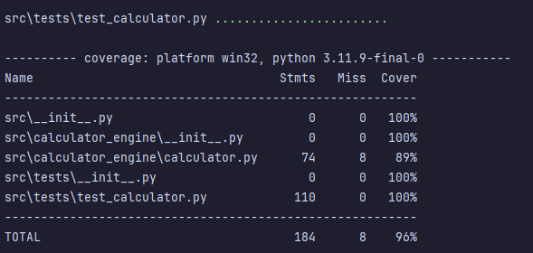

# KSU SWE 3643 Software Testing and Quality Assurance Semester Project: Web-Based Calculator
This project is working on a web-based calculator app programmed in Python by using Flask, an extensible web framework for Python. Flask provides tools, libraries, and patterns to help developers build web applications quickly and efficiently. After the calculator functions are properly working, this program will be tested in Pytest.

## Tables of Contents
- [Architecture](#architecture)
- [Environment](#environment)
- [Executing the Web Application](#executing-the-web-application)
- [Execuing Unit Tests](#executing-unit-tests)
- [Executing Unit Test Coverage](#executing-unit-test-coverage)
- [Reviewing Unit Test Coverage](#reviewing-unit-test-coverage)
- [Executing End-to-End Tests](#executing-end-to-end-tests)
- [Final Video Presentation](#final-video-presentation)
- **Extra Credits:** [Static Analysis](#static-analysis) (only include this if i do this)

## Team Members:
I'm [Emily Zhu](https://github.com/itswindee), and I am the only team member of this project. :)

## Architecture
This web-based calculator application project is split into 4 sections. The calculator engine, the web application, the unit tests. and the end-to-end tests. The calculator engine is the core of the application, which contains the functions that will be used in the web application. The web application is the user interface that will be used to interact with the calculator engine. The unit tests will be used to test the functions in the calculator engine. The end-to-end tests will be used to test the web application. For this project, I will be testing with **Pytest** and **Playwright**.


## Environment
This is a cross platform application that is available for Windows, macOS, and Linux. Currently, this application has only been tested on Windows and macOs. (***NOTE***: macOs usually comes with Python pre-installed, but you can download the latest version of Python using the link.)

To prepare your environment to execute this application:
**Install the latest version of Python for your device.** As of March 2024, this application is using Python 3.12.0.
- [Windows](https://www.python.org/downloads/)
- [macOs](https://www.python.org/downloads/macos/)
- [Linux](https://www.python.org/downloads/source/)

## Executing the Web Application
This application is being tested using the JetBrains PyCharm IDE. If you don't have PyCharm installed already, I have provided the [link](https://www.jetbrains.com/pycharm/download/?section=windows) to the download.  Once you have [Python](https://www.python.org/downloads/) and [PyCharm](https://www.jetbrains.com/pycharm/download/?section=windows) installed, you can install Flask using 'pip' - Python's package manager.

   Open a terminal or command prompt. Run the following command to install Flask: 

   ```
      pip install Flask
   ```

   You can verify that Flask has installed properly by running this command to check its version:
    
   ```
      flask --version
   ```
    
   To view the Flask application, run the program. You should see a warning message similar to this:

   

   Click on the URL shown and it will prompt a pop-up on your screen to view the Flask application.

## Executing Unit Tests

**Configuring Pytest for unit tests:**

Run the following command in your command line (terminal/console) to install Pytest:
   
```
   pip install -U pytest
```
Make sure you have the correct version installed.
```
   $ pytest --version
```

If you run into any issues getting Pytest to install properly, here is a [link](https://www.youtube.com/watch?v=yA5jqNCCOLE&t=499s) to a tutorial that I found very helpful.

<br>

**Configuring Playwright for end-to-end testing:**

Run the following command in your command line (terminal/console) to install Playwright:
   
```
   pip install playwright
```

```
   playwright install
```

## Executing Unit Test Coverage
To execute the unit test coverage:
1. Run terminal/command prompt and change the directory to the project folder.
```
   cd path/to/project
```
2. Run the following command to execute the unit test coverage:
```
    pytest --cov=.
```


## Reviewing Unit Test Coverage
After executing the unit test coverages, you should see the following results:


Here is the test coverage for the calculator engine:

<br><br>
If you want to see the test coverage in HTML format, you can run the following command.
```
   pytest --cov-report html
```
Then, you can open the HTML file in your browser to view the test coverage in a more detailed format.


## Executing End-to-End Tests
To execute the end-to-end tests:
1. Run terminal/command prompt and change the directory to the project folder.
```
   cd path/to/project
```

## Final Video Presentation
[Link to the final video presentation.]() NOT AVAILABLE YET

## Static Analysis